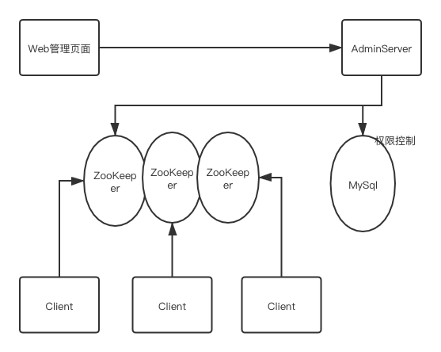

## 配置中心

 


## 使用前提

- 配置中心基于 zookeeper 来设计，需提前搭建好 zk 集群。

- 为每个项目定义唯一的 namespace. 此为监听配置变更的默认路径 (唯一项目名称即可，该项目所有配置都在该命名空间下)

- 管理后台使用 MySQL 做权限校验，同时使用了 Redis。本地启动时需提前安装好以上中间件。

## SpringBoot 接入方式

1. 引入 maven 依赖
    ```xml
    <dependency>
        <groupId>com.configcenter</groupId>
        <artifactId>cc-client</artifactId>
        <version>1.0-SNAPSHOT</version>
    </dependency>
    ```

2. 初始化 ConfigManager
    ```java
    @Configuration
    public class ConfigCenter {
    
        @Value("${zookeeper.connectString:localhost:2181}")
        private String zkConnectString;
    
        @Value("${spring.application.name}")
        private String namespace;
    
        @Bean
        public ConfigManager configManager() {
            CuratorManager curatorManager = new CuratorManager();
            curatorManager.setNameSpace(namespace);
            curatorManager.setConnectString(zkConnectString);
            curatorManager.init();
            return new ConfigManagerImpl(curatorManager);
        }
    }
    
    ```

3. 通过 ConfigManager 读写配置
    ```java
    
    ```
 
 ## 管理后台
 
 1. 登录 （展示能配置的项目）
 2. 配置：增删改查